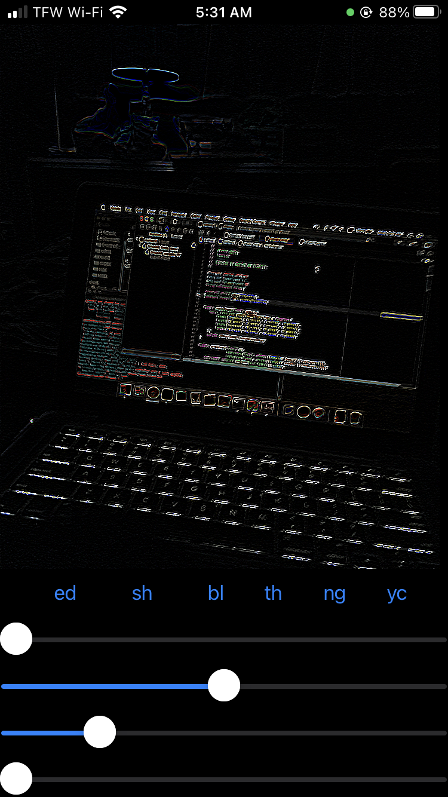
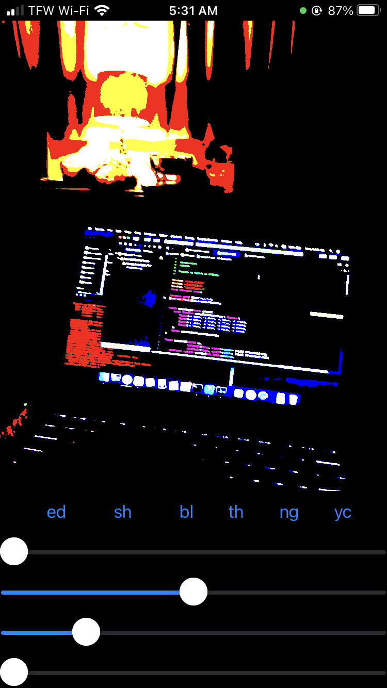
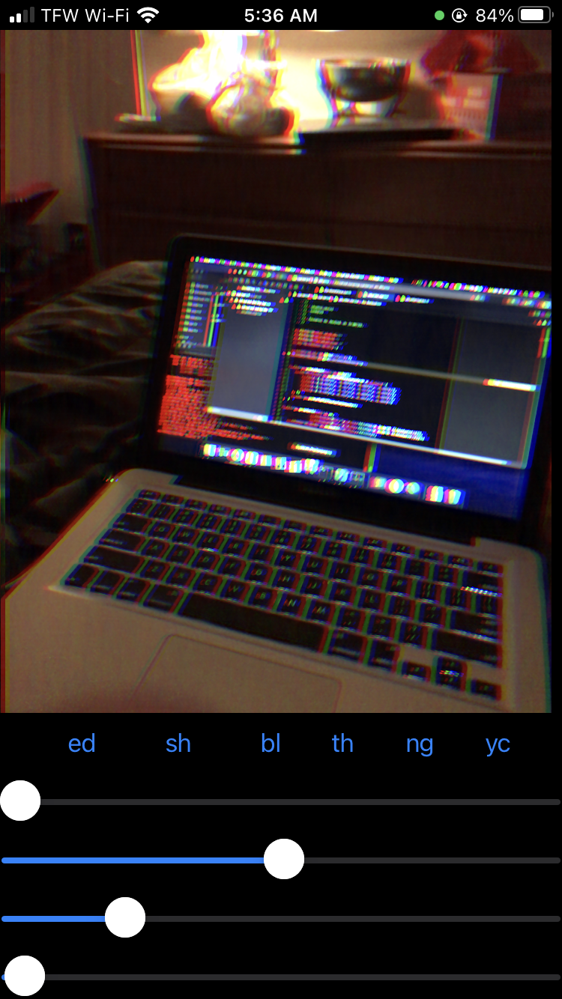
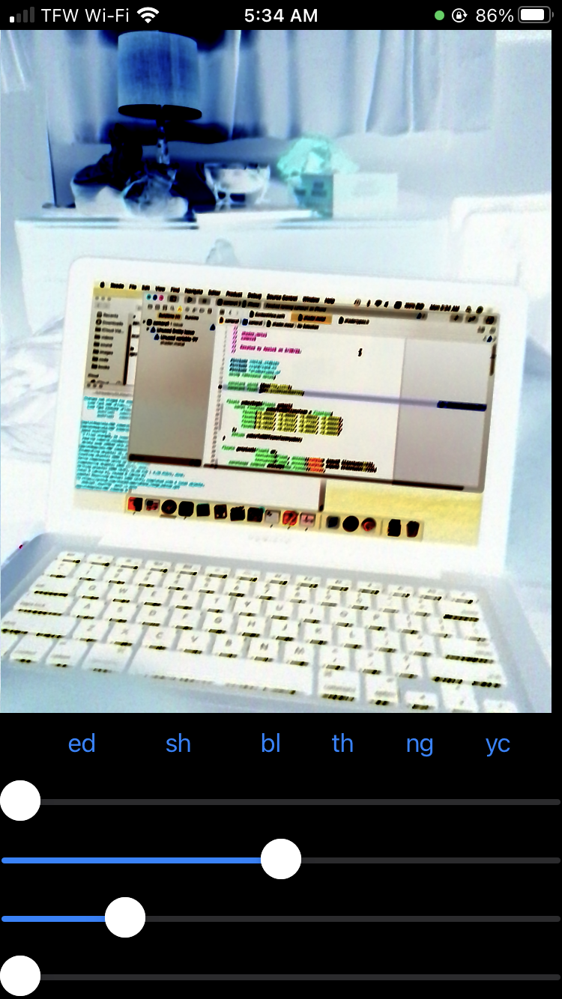
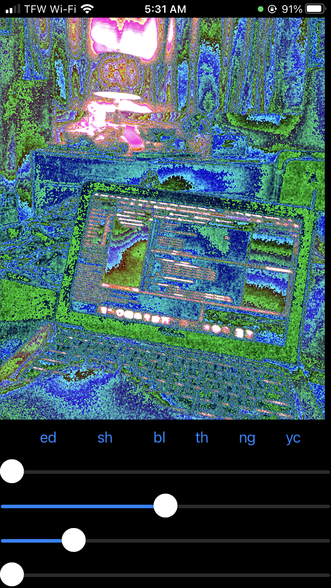

# iPhone Image Editor

This iOS app takes a live camera feed and performs an operation on each pixel in the image.
The camera runs a 60 frames per second which requires extremely fast per-pixel operations
for real-time editing.  The editing is done on the GPU using Metal compute shaders.

This app isnt intended for photo editing.  It operates on a live camera feed but doesnt save the results. 

## Examples

* Edge Detection \
 \
* Thresholding \
 \
* Chromatic Abberation \
 \
* Image Negative \
 \
* Weird Glitch That I Like \

